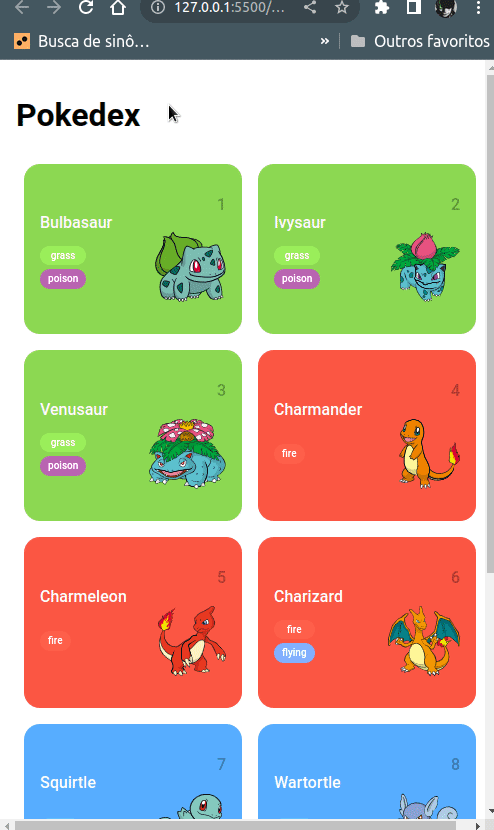

# conteudo

## Requisição HTTP

ESTRUTURA

- **url:**  https://pokeapi.co/api/v2/pokemon

    -  ${IP}/${path= caminho de identificação do recurso}

- **DOMINIO/IP:** https://pokeapi.co

- **path:** /api/v2/pokemon

- **Request Method** GET | POST | PUT | DELETE | PATCH ...

PARAMETRO DE UMA URL

- https://pokeapi.co/api/v2/pokemon/1
- https://pokeapi.co/api/v2/pokemon/${id}

QUERY STRING

- https://pokeapi.co/api/v2/pokemon?type=grass&name=i
  - ?type=grass&name=i
    - DAQUI PRA FRENTE É UM FILTRO QUERY
      - ?
    - CHAVE VALOR
      - type=grass
      - name=i

HEADERS

- REQUEST HEADERS
  - configurações
    - accept-language: 
      - pt-BR,
      - pt;q=0.9,
      - en-US;q=0.8,
      - en;q=0.7

- RESPONSE HEADERS
  - configurações
    - content-encoding:
      - br

PROCESSO DE REQUISIÇÃO HTTP

1. REQUEST METHOD: GET | POST | PUT | DELETE
2. REQUEST HEADERS
    - content-type: application/json
3. STATUS CODE
    - 200
4. RESPONSE HEADER
    - ...
5. RESPONSE BODY
    - {"nome": teste}

## função fetch

Com ele posso usar métodos para tratar a o Promisse da URL.
Promisse é a informação/promessa esperada do servidor.

## .then

Método usado no fetch para pegar o retorno da url e tratar ela. Exemplo: filtrei o conteúdo do URL transformando o retorno dessa URL/Promisse em um Json.

## função map

Converte uma lista em ou outro tipo. Exeplo: usando a pokeApi recebi do servidor uma lista de objetos, então usei o map para converter para string, substituindo o for que percorreria a lista e o push para guardar informações necessárias do objeto em uma lista vazia.

## Resultado da integraçao da pokeApi

